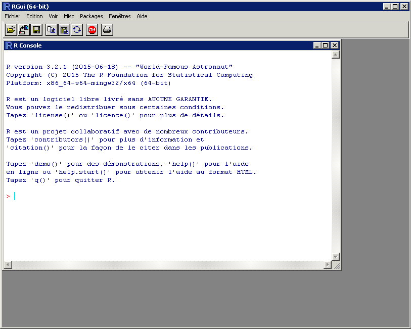
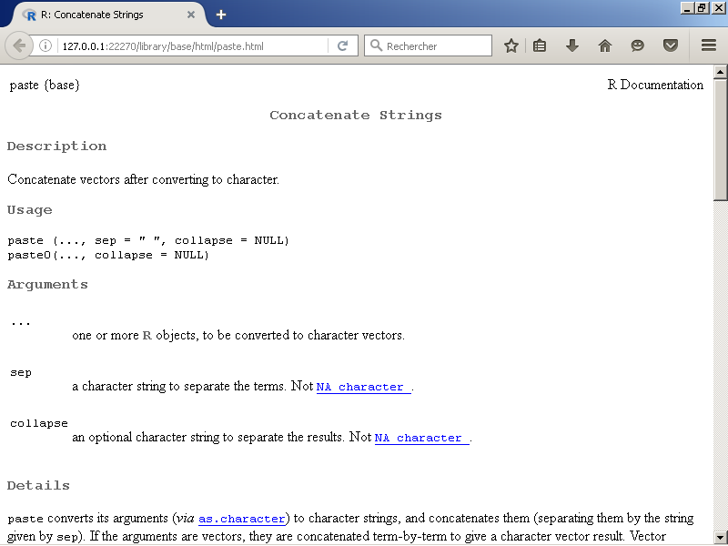
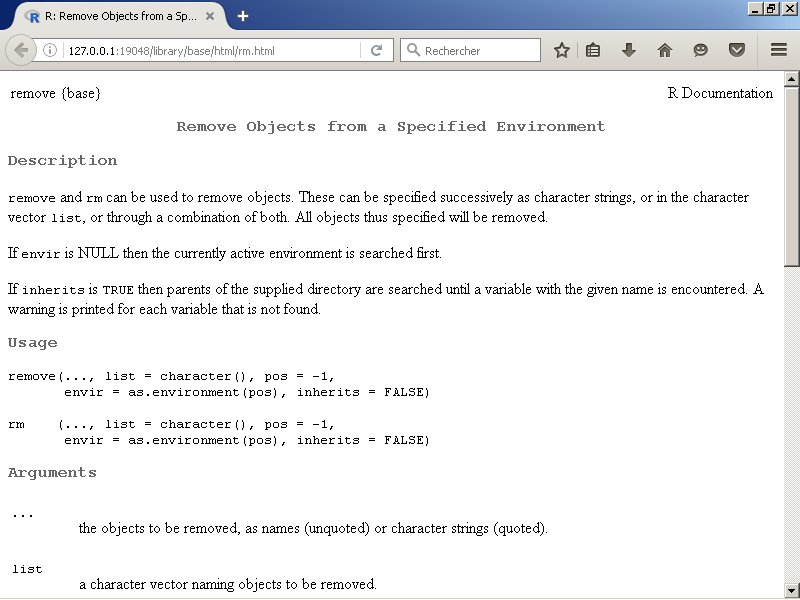
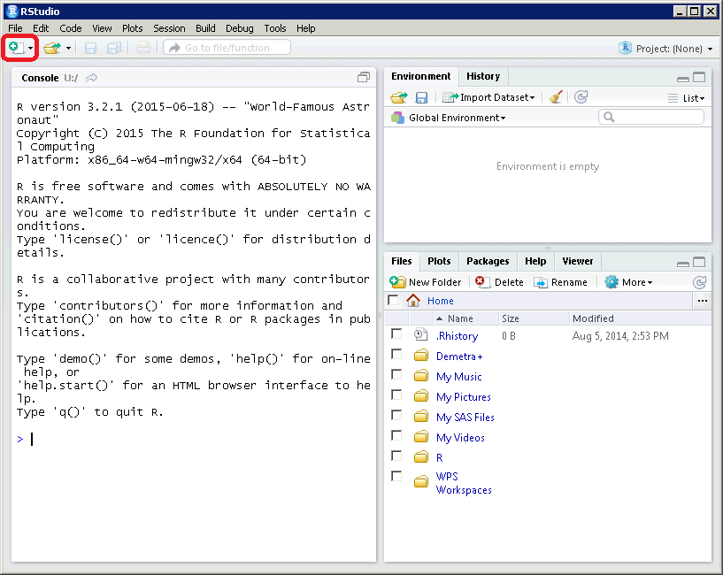
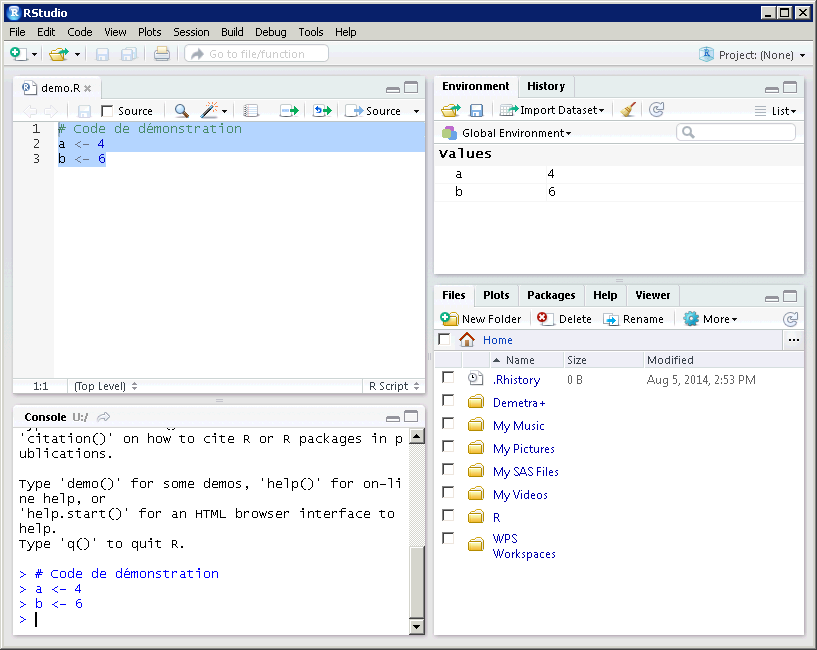
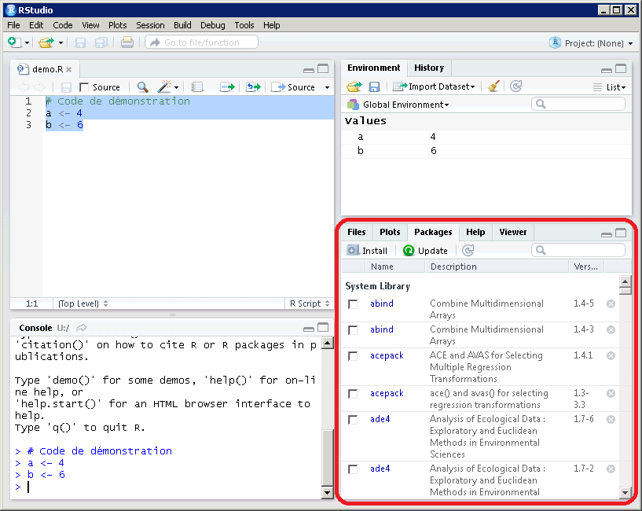

```{r, include = FALSE}
rm(list = ls())
if(!exists(".initOK")) source("init.R", encoding = "latin1")
```

```{r, results = "asis", echo = FALSE}
.module(numModule = 1, "Prise en main du logiciel")
```

```{r, results = "asis", echo = FALSE}
.partie("Un peu d'histoire et quelques grands principes")
```


R est un langage utilisé pour le traitement de données statistiques créé au début des années 1990 par deux chercheurs de l'université d'Auckland, Ross Ihaka and Robert Gentleman. Il reprend de très nombreux éléments du langage S créé par le statisticien américain John Chambers à la fin des années 1970 au sein du laboratoire Bell.

La première version stable a été rendue publique en 2000 : d'abord principalement diffusé parmi les chercheurs et les statisticiens "académiques", R est aujourd'hui **de plus en plus utilisé au sein des Instituts nationaux de statistiques**.


```{r, results = "asis", echo = FALSE}
.souspartie("R : un logiciel libre")
```


À la différence d'autres logiciels de traitement statistique (SAS, SPSS ou Stata notamment), R est un **logiciel libre** : sa licence d'utilisation est gratuite et autorise chaque utilisateur à **accéder, modifier ou redistribuer son [code source](https://github.com/wch/r-source)**. En pratique, il est maintenu par une équipe (la *[R Core Team](https://www.r-project.org/contributors.html)*) qui veille à la stabilité du langage et de ses implémentations logicielles.

Une des conséquences de cette philosophie "libre" présente dès les premières années du développement du langage est le rôle qu'y jouent les **modules complémentaires**, ou ***packages***. Au-delà des "briques" fondamentales de la *R Core Team*, **plusieurs milliers de *packages* sont disponibles et librement téléchargeables** *via* le [*Comprehensive R Archive Network*](https://cran.r-project.org/) (ou CRAN) ou encore par le biais de plate-formes de développement collaboratif comme [GitHub](https://github.com/). Ces *packages*, dont l'installation est particulièrement simple dans R, enrichissent considérablement les fonctionnalités du logiciel et sont une de ses principales forces.

------------

**Remarque importante** Comme de nombreux logiciels libres, R est très influencé par le fonctionnement du système d'exploitation Linux. À ce titre, **certains éléments de sa syntaxe peuvent dérouter un utilisateur de Windows** :

- **R est sensible à la casse** : il distingue ainsi `matable` de `MATABLE` ou encore de `maTable`, même sous Windows (contrairement à SAS notamment) ;
- **dans R les chemins doivent utiliser des `/` et non des `\`** : ainsi, pour pointer vers le dossier `U:\monEnquete\donnees` il faut saisir dans R `U:/monEnquete/donnees`.

------------

\ 

De manière plus générale, le fonctionnement de R est **plus proche de celui d'un langage de programmation "classique"** (Python, C, Java, etc.) **que de celui des autres logiciels de traitements statistiques**. Une manière d'introduire cet aspect fondamental du logiciel est de développer la **célèbre citation de John Chambers**: 

> *To understand computations in R, two slogans are helpful:*
>
> - *Everything that exists is an object.*
>
> - *Everything that happens is a function call.*
>
> *John Chambers*


```{r, results = "asis", echo = FALSE}
.souspartie("\"Tout ce qui existe est un objet\"")
```

Tout ce qui existe et est manipulable dans R est un **objet** identifié par son nom et par son **environnement de référence**. Par défaut, tous les objets créés par l'utilisateur apparaissent dans l'environnement dit "global" (`.GlobalEnv`) qui est implicite, de façon analogue à la bibliothèque `WORK` de SAS.

Pour créer un objet, la méthode la plus simple consiste à assigner une valeur à un nom avec l'opérateur `<-``r .fun("<-", bold = TRUE)`. Par exemple :

```{r, collapse = TRUE}
a <- 4
```

assigne la valeur 4 à l'objet `a` (dans l'environnement global). Dès lors, il est possible d'afficher la valeur de `a` et de la **réutiliser dans des calculs** :

```{r, collapse = TRUE}
# Affichage de la valeur de a avec la fonction print() ...
print(a)

# ... ou tout simplement en tapant son nom
a

# Utilisation de a dans un calcul
2 * a

# Définition et utilisation de b
b <- 6
a * b
```

Il est bien sûr possible d'assigner à un nom **non pas une valeur numérique unique** (comme ici 4 à `a` et 6 à `b`) **mais des données provenant d'une table externe**. 

**Exemple** Le code suivant associe à l'objet `reg` les caractéristiques des régions dans le [Code officiel géographique](https://www.insee.fr/fr/information/2666684) (COG) au 1er janvier 2017.

`r .fun("read.delim")`
```{r}
# Lecture du fichier du COG contenant le nom des régions
# et stockage dans l'objet dont le nom est `reg`
reg <- read.delim("reg2017.txt")
```

```{r, eval=FALSE}
# Affichage de l'objet reg
reg
```
```{r, echo=FALSE}
reg[, -5]
```

\ 

Dans tous les cas, les objets créés sont **stockés dans la mémoire vive de l'ordinateur** (comme dans Stata), ce qui présente des avantages et des inconvénients :

- (+) on ne modifie jamais les fichiers originaux, uniquement les objets chargés en mémoire ;
- (+) les opérations sur les objets chargés peuvent être **extrêmement rapides**, car elles ne nécessitent pas de lire des données sur le disque ;
- (-) à chaque lancement de R il faut **recharger les données nécessaires en mémoire** ;
- (-) la **taille totale des données chargées ne peut pas excéder celle de la mémoire vive installée** (80 Go partagés sur un serveur AUS actuellement).


```{r, results = "asis", echo = FALSE}
.souspartie("\"Tout ce qui se produit est un appel de fonction\"")
```

Une fois les objets sur lesquels on souhaite travailler créés (*i.e.* les tables importées), R dispose d'un grand nombre de **fonctions** pour transformer ces données et mener à bien des traitements statistiques. **Dans R une fonction est un type d'objet particulier** : une fonction est identifiée par son nom (dans un environnement de référence) suivi de parenthèses.

**Exemple** La fonction `ls()``r .fun("ls")` (sans argument) permet d'afficher les objets chargés en mémoire.

```{r}
# Affichage des objets chargés en mémoire avec ls()
ls()
```

Il y a pour l'instant trois objets en mémoire : `a`, `b` et `reg`. 

**Progresser dans la maîtrise de R signifie essentiellement étendre son "vocabulaire" de fonctions connues**. Avec le temps, il est fréquent que l'on revienne sur d'anciens codes pour les simplifier en utilisant des fonctions découvertes entre temps (ou parfois en exploitant mieux les mêmes fonctions !).

\ 


**Il est également extrêmement facile et courant dans R de créer ses propres fonctions**.

**Exemple** La fonction `monCalcul()` renvoie le résultat de `param1 * 10 + param2`, où `param1` et `param2` sont deux paramètres.`r .fun("function", bold = TRUE)`

```{r}
# Définition de la fonction monCalcul()
monCalcul <- function(param1, param2){
  resultat <- param1 * 10 + param2
  return(resultat)
}

# Test de la fonction monCalcul() avec les valeurs 1 et 3
monCalcul(1, 3)

# Test de la fonction monCalcul() avec les valeurs a et 2
a
monCalcul(a, 2)
```

Quand on saisit uniquement le **nom de la fonction (sans parenthèse)**, R affiche son code :
```{r}
# Affichage du code de la fonction monCalcul()
monCalcul
```

À noter que **rien ne distingue les fonctions pré-chargées dans le logiciel** (comme `read.delim()` ou `ls()` utilisées précédemment) **des fonctions créées par l'utilisateur**. Il est ainsi tout à fait possible d'afficher le code de ces fonctions.`r .fun("read.delim")`
```{r}
# Affichage du code de la fonction read.delim()
read.delim
```

C'est une **conséquence du caractère "libre" du logiciel** : non seulement le code des fonctions pré-chargées est consultable, mais il est également modifiable.

**Exemple** Il est tout à fait possible dans R (même si cela n'a *a priori* pas grand intérêt...) de modifier la signification des signes arithmétiques (qui comme toutes les autres opérations dans R correspondent à des fonctions).

```{r}
# On décide d'associer au signe + l'opération effectuée habituellement 
# par le signe - :
`+` <- `-`

# Le signe + est désormais associé à la soustraction :
2 + 2
```

Cet exemple illustre la **très grande souplesse de R comme langage** : tous ses aspects sont modifiables, si bien qu'il est possible de **développer facilement des programmes R parfaitement adaptés aux besoins les plus spécifiques**.

```{r, results = "asis", echo = FALSE}
.partie("Découverte de l'interface")
```

```{r, echo = FALSE}
rm(list=ls())
```

En tant que tel, R est un *langage* susceptible d'être implémenté dans de [nombreuses interfaces](https://fr.wikipedia.org/wiki/R_(langage)#Interfaces). Le choix est fait ici de présenter d'abord son **implémentation minimale** (en mode "console") puis une **implémentation beaucoup plus complète** par le biais du programme [RStudio](https://www.rstudio.com/). Dans tous les cas, la plate-forme utilisée est Windows.

```{r, results = "asis", echo = FALSE}
.souspartie("Effectuer des manipulations de base dans la console")
```

Par défaut sous Windows, R est fourni avec une interface graphique minimiale (`Rgui.exe`), dont la fenêtre principale est une **console**, c'est-à-dire un **terminal** dans lequel taper des instructions (comparable à l'invite de commandes Windows). Les instructions sont à taper après le signe `>` en rouge.



Toutes les commandes peuvent être passées au logiciel par le biais de la console, même si **en pratique les commandes les plus longues sont stockées et soumises depuis un fichier de script** (*cf.* la sous-partie suivante). En particulier, il est fréquent d'effectuer dans la console:

- **des assignations et des rappels de valeur** : le signe `<-` permet d'assigner des valeurs à des noms pour être réutilisées ultérieurement. Quand une valeur est assignée à un nom, il suffit de taper le nom dans la console pour afficher la valeur.

- **des opérations sur les objets en mémoire** :
    + la fonction `ls()``r .fun("ls", bold = TRUE)` affiche tous les objets en mémoire ;
    + la fonction `str(a)``r .fun("str", bold = TRUE)` affiche les caractéristiques (ou encore la *structure*) de l'objet `a` (son type, sa longueur, etc.) ;
    + la fonction `rm(a)``r .fun("rm", bold = TRUE)` supprime l'objet `a`.
    
- **des requêtes pour l'aide** : pour afficher l'aide sur une fonction dont le nom est `maFonction`, il suffit d'utiliser `help(maFonction)``r .fun("help", bold = TRUE)` ou plus simplement `? maFonction``r .fun("?", bold = TRUE)`.

- **des opérations simples** : le tableau ci-dessous présente quelques opérations arithmétiques et les symboles correspondant en R.

    Code R     | Résultat
    ------------- | -------------
    `a + b``r .fun("+", bold = TRUE)`       | Somme de a et b
    `a - b``r .fun("-", bold = TRUE)`       | Soustraction de b à a
    `a * b``r .fun("*", bold = TRUE)`       | Produit de a et b
    `a / b``r .fun("/", bold = TRUE)`       | Division de a par b
    `a ^ b``r .fun("\\textasciicircum", bold = TRUE)`    | a puissance b
    `a %/% b``r .fun("\\%/\\%", bold = TRUE)`   | Quotient de la division euclidienne de a par b
    `a %% b``r .fun("\\%\\%", bold = TRUE)`    | Reste de la division euclidienne de a par b
    `sqrt(a)``r .fun("sqrt", bold = TRUE)`     | Racine carrée de a


```{r, results = "asis", echo = FALSE}
.question("Convertir une durée de secondes en minutes-secondes")
```
Il est souvent très utile de mesurer et d'afficher la durée d'un traitement un peu long (script exécuté régulièrement par exemple). La fonction `system.time()``r .fun("sys.time")` de R n'affiche néanmoins que le temps écoulé en *secondes*, ce qui n'est guère lisible. **L'objectif de ce cas pratique est de convertir une durée de secondes en minutes-secondes**.

a. Ouvrez une session AUS (en utilisant votre idep et votre mot de passe) et lancez le programme R (pas Rstudio).

b. Dans la console, associez la valeur 2456 à l'objet `duree`.  C'est sur cette durée (en secondes) que vont porter tous les calculs. Une fois assignée, rappelez la valeur de `duree` dans la console.`r .fun("<-")`

    ```{r, results = "asis", echo = FALSE}
    .beginsol()
    ```
    ```{r}
    # Note : Pour copier-coller les éléments de solution,
    # vous pouvez utiliser les raccourcis clavier Ctrl + C
    # (copier) et Ctrl + V (coller).
    
    # Pour assignez une valeur à un objet, on utilise l'opérateur <-
    duree <- 2456
    # Pour soumettre une opération en mode console, il suffit d'appuyer
    # sur ENTREE.
    
    # Dès lors qu'une valeur est assignée à un objet, il suffit de taper
    # le nom de l'objet dans la console pour rappeler sa valeur :
    duree
    ```
    ```{r, results = "asis", echo = FALSE}
    .endsol()
    ```

c. Calculez le nombre de minutes correspondant à la valeur de `duree`. Comment obtenir un nombre entier (*cf.* le tableau des opérations arithmétiques) ? Associez cette valeur à l'objet `min`.`r .fun("/")``r .fun("\\%/\\%")`

    ```{r, results = "asis", echo = FALSE}
    .beginsol()
    ```
    ```{r}
    # Pour obtenir le nombre de minutes dans duree, il suffit de
    # diviser par 60 :
    duree / 60
    # Néanmoins, pour obtenir un nombre entier de minutes, il faut utiliser
    # la division euclidienne (cf. tableau)
    duree %/% 60
    # On stocke le nombre de minutes dans l'objet min avec <-
    min <- duree %/% 60
    min
    ```
    ```{r, results = "asis", echo = FALSE}
    .endsol()
    ```

d. Calculez le nombre de secondes restantes une fois le nombre de minutes déterminé. Vous pouvez utiliser la flèche $\uparrow$ du clavier pour rappeler et modifier le code que vous venez de soumettre. Associez cette valeur à l'objet `sec`.`r .fun("\\%\\%")`

    ```{r, results = "asis", echo = FALSE}
    .beginsol()
    ```
    ```{r}
    # Calculer le nombre de secondes restantes revient à calculer
    # le reste de la division euclidienne de duree par 60 : c'est ce
    # que fait l'opérateur %% (cf. tableau).
    duree %% 60
    # A nouveau, on rappelle le code saisi précédemment avec la flèche
    # HAUT du clavier et on associe la valeur à l'objet sec avec l'opérateur <-.
    sec <- duree %% 60
    sec
    ```
    ```{r, results = "asis", echo = FALSE}
    .endsol()
    ```

e. Utilisez la fonction `help()` (ou de façon équivalente `?`) pour recherchez de l'aide sur la fonction `paste()``r .fun("help")``r .fun("?")``r .fun("paste")`. Que se passe-t-il quand vous soumettez le code 
    ```{r, eval = FALSE}
paste("La durée est de", duree, "secondes.")
    ``` 
    En utilisant tous ces éléments, afficher dans la console le texte :
    ```{r, echo = FALSE}
"Le traitement a duré `min` minutes et `sec` secondes."
    ```
    
    ```{r, results = "asis", echo = FALSE}
    .beginsol()
    ```
    ```{r, eval = FALSE}
    # Pour consulter l'aide de R, il suffit d'utiliser la fonction help()
    # avec entre parenthèses le nom de la fonction sur laquelle on souhaite
    # obtenir de l'aide. 
    help(paste)
    # On peut aussi plus simplement utiliser ? :
    ? paste
    # Un navigateur s'ouvre alors pour afficher la page d'aide de la fonction.
    ```
    
    ```{r}
    # On y apprend que cette fonction sert à concaténer des "vecteurs"
    # (cf. module 2 de la formation). En soumettant l'exemple proposé,
    # on obtient :
    paste("La durée est de", duree, "secondes.")
    
    # Ce code produit une chaîne de caractère : les chaînes de texte
    # (entre "") sont reproduites telles quelles mais l'objet `duree`
    # est remplacé par sa valeur. Les différents arguments de la fonction
    # paste() sont séparés par des virgules.
    
    # Pour répondre à la question, il suffit donc d'utiliser les objets
    # `min` et `sec` définis précédemment comme arguments de la fonction paste() :
    paste("Le traitement a duré", min, "minutes et", sec, "secondes.")
    ```
    ```{r, results = "asis", echo = FALSE}
    .endsol()
    ```

```{r, results = "asis", echo = FALSE}
.question("Manipuler des objets en mémoire")
```
Par défaut en mode console, l'utilisateur ne dispose d'aucune information sur les objets stockés en mémoire. **L'objectif de ce cas pratique est de vous familiariser avec les principales fonctions de manipulation des objets en mémoire.**

a. Utilisez la fonction `ls()``r .fun("ls")` (sans argument) pour afficher les objets actuellement stockés en mémoire. Affectez la valeur 567 à l'objet `Duree` (avec un `D` majuscule) et relancez la fonction `ls()`. Pourquoi R distingue-t-il les objets `duree` et `Duree` ?

    ```{r, results = "asis", echo = FALSE}
    .beginsol()
    ```
    ```{r}
    # Utilisée sans arguments, la fonction ls() liste tous les objets 
    # stockés dans l'environnement de référence de R
    ls()
    Duree <- 567
    ls()
    # R distingue les objets duree et Duree car il est sensible à la casse.
    ```
    ```{r, results = "asis", echo = FALSE}
    .endsol()
    ```

b. Associez à l'objet `monTexte` la chaîne de caractère `"Hello world!"`. En utilisant la fonction `str()``r .fun("str")`, comparez les caractéristiques des objets `duree` et `monTexte`. À quel type chacun de ces deux objets appartient-il ?

    ```{r, results = "asis", echo = FALSE}
    .beginsol()
    ```
    ```{r}
    # Comme dans la fonction paste(), la manipulation de chaînes 
    # de caractère nécessite l'utilisation de guillemets ""
    monTexte <- "Hello world!"
    ls()
    
    # La fonction str(a) permet d'afficher les caractéristiques
    # de l'objet a.
    str(duree)
    str(monTexte)
    # duree est un objet de type numérique alors que
    # monTexte est un objet de type caractère.
    ```
    ```{r, results = "asis", echo = FALSE}
    .endsol()
    ```

c. Utilisez la fonction `rm()``r .fun("rm")` pour supprimer les objets `Duree` et `monTexte`. Vérifiez que la suppression est effective (et  n'a pas affecté `duree`) en relançant la fonction `ls()``r .fun("ls")`.

    ```{r, results = "asis", echo = FALSE}
    .beginsol()
    ```
    ```{r}
    # Objets présents au début de la question
    ls()
    
    # La fonction rm() (de l'anglais remove) permet de supprimer 
    # un ou plusieurs objets.
    rm(Duree, monTexte)
    ls()
    # Les objets Duree et monTexte ont bien été supprimés.
    ```
    ```{r,results = "asis",echo = FALSE}
    .endsol()
    ```

d. Recherchez de l'aide sur la fonction `rm()``r .fun("rm")`, et plus spécifiquement sur son argument `list`. En utilisant cet argument combiné avec la fonction `ls()``r .fun("ls")`, écrivez une instruction qui supprime tous les objets dans l'environnement de référence de R.

    ```{r, results = "asis", echo = FALSE}
    .beginsol()
    ```
    ```{r, eval = FALSE}
    # Pour recherchez de l'aide sur une fonction, on utilise tout simplement ?
    ? rm
    ```
    
    ```{r}
    # L'argument list permet de spécifier les objets à supprimer
    # sous la forme d'une vecteur de type caractère. Or c'est précisément
    # ce que produit la fonction ls() :
    ls()
    
    # Pour supprimer tous les éléments en une seule commande, il suffit
    # de spécifier le résultat de la commande ls() à l'argument list de la
    # fonction rm() :
    rm(list = ls())
    
    # On vérifie alors qu'il n'y a plus aucun objet 
    # dans l'environnement de référence :
    ls()
    ```
    ```{r, results = "asis", echo = FALSE}
    .endsol()
    ```


```{r, results = "asis", echo = FALSE}
.souspartie("Utiliser des scripts dans RStudio")
```

Quoique toutes les fonctionnalités de R soient accessibles en mode console, ce type d'interface présente l'inconvénient majeur de **ne pas permettre de garder facilement une trace du code saisi** (sinon par le biais de l'historique des commandes accessible par $\uparrow$). Pour combler ce manque, les différentes interfaces graphiques de R permettent d'utiliser des **scripts** au format `.R`, à l'image des éditeurs de SAS (fichiers `.sas`) ou des *do-file* de Stata (fichiers `.do`).

En particulier, l'environnement de développement **RStudio** propose de nombreuses fonctionnalités qui **rendent l'utilisation de R beaucoup plus simple et intuitive** : explorateur d'environnements, colorisation et auto-complétion du code, afficheur de fenêtres d'aide et de résultats, etc.



À l'ouverture de **RStudio**, en règle générale trois panneaux sont visibles :

- La **console** (à gauche par défaut) : la principale différence avec précédemment tient à la couleur du texte, noire pour les messages et bleue pour le signe `>`. Pour vider l'intégralité de la console, taper `Ctrl + L`.
- L'**explorateur d'environnements et l'historique** (en haut à droite par défaut) : l'explorateur d'environnements permet d'afficher les objets présents (comme la fonction `ls()`) dans l'environnement de référence; l'historique rappelle toutes les commandes saisies à la manière de la touche $\uparrow$ dans la console.
- La **fenêtre de visualisation** (en bas à droite par défaut) : ce panneau intègre à la fenêtre du logiciel l'aide ou encore les graphiques produits.

En appuyant sur "Nouveau" > "Script R" (bouton entouré en rouge dans la figure précédente), les fenêtres se réorganisent pour faire apparaître une zone de texte : l'**éditeur de script**.



L'utilisation de l'éditeur de scripts sous **RStudio** est analogue à celle de l'éditeur sous SAS ou du *do-file editor* de Stata :

- il est possible d'**enregistrer** et d'**ouvrir un script** avec les boutons de la barre d'outils correspondants. Le format d'enregistrement par défaut est `.R`, mais le fichier est directement lisible par n'importe quel éditeur de texte (bloc-note ou Notepad++ sous Windows par exemple) ;
- pour **soumettre une ou plusieurs lignes de code**, il suffit de les sélectionner et de saisir au clavier **Ctrl\ +\ R** ou **Ctrl\ +\ Entrée** ;
- les **éléments de syntaxe apparaissent en couleur** : les commentaires (précédés de `#` à chaque ligne) en vert clair, les objets en noir, les nombres en bleu et les chaînes de caractère (entre `""` ou `''`) en vert foncé. Pour **commenter plusieurs lignes de code simultanément**, il suffit d'utiliser le raccourci **Ctrl\ +\ Maj\ +\ C**;
- des **suggestions apparaissent au cours de la frappe** : quand **RStudio** détecte le début du nom d'un objet déjà défini (par exemple une fonction), il fournit des **propositions d'auto-complétion**. Le logiciel double également automatiquement les guillemets et les parenthèses.

```{r, results = "asis", echo = FALSE}
.question("Construire une fonction de conversion de secondes en minutes-secondes")
```
Ce cas pratique reprend les éléments du cas pratique 1.1. Son objectif est de construire une fonction `conversion()` qui, à partir d'un paramètre `duree` exprimé en secondes, crée une chaîne de caractère du type
```{r, echo = FALSE}
"Le traitement a duré `min` minutes et `sec` secondes."
```

\ 

a. Toujours sur AUS, ouvrez le programme **RStudio**. Créez un nouveau script et sauvegardez-le sous votre répertoire personnel `U:\` (par exemple sous `U:\R_initiation\module1.R`).

b. En vous inspirant de l'exemple de la fonction `monCalcul()` (*cf.* *supra*), écrivez dans le script une première version de la fonction `conversion()` qui, à partir du paramètre `duree`, affiche le temps en secondes correspondant (sans le modifier dans un premier temps).`r .fun("function")`

    ```{r, results = "asis", echo = FALSE}
    .beginsol()
    ```
    ```{r}
    # La structure de base d'une définition de fonction est simple :
    # l'opérateur d'assignation est utilisé pour associer à un nom
    # le code de la fonction
    conversion <- function(duree){
      return(duree)
    }
    # Dans cette première version, on ne fait que renvoyer la valeur
    # de duree à l'identique.
    conversion(2456)
    ```
    ```{r, results = "asis", echo = FALSE}
    .endsol()
    ```

c. Intégrez à la fonction `conversion()` les éléments définis aux différentes étapes du cas pratique 1.1 (définition de `min`, de `sec`, concaténation avec la fonction `paste()`) pour atteindre le résultat désiré. Testez votre fonction avec les valeurs 2456 et 7564.`r .fun("function")`

    ```{r, results = "asis", echo = FALSE}
    .beginsol()
    ```
    ```{r}
    # On reprend les éléments du cas pratique 1.1 pour rendre la fonction
    # véritablement opérante :
    conversion <- function(duree){
      min <- duree %/% 60
      sec <- duree %% 60
      resultat <- paste(
        "Le traitement a duré", min, "minutes et", sec, "secondes."
      )
      return(resultat)
    }
    conversion(2456)
    conversion(7564)
    ```
    ```{r, results = "asis", echo = FALSE}
    .endsol()
    ```

d. Observez comment l'éditeur colorise votre code, mais aussi les différents objets créés dans l'explorateur d'environnements. Saisissez dans l'éditeur ou la console les lettres `conver` et utilisez l'auto-complétion pour sélectionner votre fonction. Ajoutez des commentaires (précédés par `#`), manuellement ou en utilisant le raccourci clavier Ctrl\ +\ Maj\ +\ C.

\ 


```{r, results = "asis", echo = FALSE}
.partie("Charger et explorer des données")
```


**Explorer des données statistiques avec R est relativement intuitif**, en particulier grâce aux fonctionnalités de RStudio : affichage des objets chargés en mémoire, explorateur d'objets, auto-complétion. **Manipuler des données exige en revanche une plus grande maîtrise des briques élémentaires du langage** qui sont présentées en détails dans le `r .ref("module 2", "module2.html")` de la formation.

\ 

R travaille sur des **objets stockés en mémoire** : pour explorer des données, la première étape consiste donc à les **charger en mémoire depuis leur emplacement sur le disque dur de l'ordinateur**. On utilise en général pour ce faire la **fonction `load()`**`r .fun("load", bold = TRUE)`: 

```{r, eval=FALSE}
# Chargement des données du fichier module1.RData
load("U:/R_initiation/donnees/module1.RData")
# NOTE : DANS R LES CHEMINS SONT INDIQUES AVEC DES / ET NON DES \
```
```{r, echo=FALSE}
load("module1.RData")
```

**La fonction `load()` charge dans l'environnement de référence les objets contenus dans le fichier `module1.RData`** en les décompressant au passage (par défaut les fichiers saugevardés par R sont compressés). L'environnement de référence comporte désormais deux nouveaux objets :

```{r}
# Fichiers présents dans l'environnement de référence
ls()

# Caractéristiques de l'objet bpe
str(bpe)
```

**L'objet `bpe` correspond à une extraction de la [Base permanente des équipements 2015](https://www.insee.fr/fr/statistiques/2410933) restreinte aux équipements de la ville de Malakoff (code Insee 92046)**. La nomenclature des équipements est présentée sur [cette page](https://www.insee.fr/fr/statistiques/2578377).

Pour parcourir ce fichier dans **RStudio**, il suffit de **cliquer sur son nom dans l'explorateur d'environnements**. Plusieurs manipulations peuvent par ailleurs être effectuées de façon relativement intuitive: 

\ 

- **afficher les premières lignes** avec la fonction `head()`, les **dernières lignes** avec la fonction `tail()``r .fun("head")``r .fun("tail")` :
    ```{r}
# Affichage des premières et dernières lignes de l'objet bpe
head(bpe)
tail(bpe)
    ```

\ 

- **accéder au contenu d'une variable avec l'opérateur `$`**`r .fun("\\$")` (ici uniquement les 20 premières valeurs pour des raisons de présentation) :
    ```{r, eval = FALSE}
# Affichage des premières de la variable codant le type d'équipement
bpe$typequ
    ```

    ```{r, echo = FALSE}
bpe$typequ[1:20]
    ```

\ 

- **calculer le total et des statistiques descriptives** sur une variable de nature quantitative avec les fonctions `sum()``r .fun("sum")` et `summary()``r .fun("summary")` :
    ```{r}
# Total et distribution de la variable dénombrant le nombre d'équipements
# par iris et par type
sum(bpe$nb_equip)
summary(bpe$nb_equip)
    ```

\ 

- **déterminer les modalités distinctes et tabuler** une variable de nature qualitative avec les fonctions `unique()``r .fun("unique")` et `table()``r .fun("table")` :
    ```{r}
# Liste des iris associés à la commune de Malakoff
unique(bpe$dciris)

# Nombre de types d'équipements distincts par iris à Malakoff
table(bpe$dciris)
    ```

\ 

- **appliquer une fonction selon les modalités d'une autre variable** avec la fonction `by()``r .fun("by")` :
    ```{r}
# Nombre total d'équipements par iris
by(bpe$nb_equip, bpe$dciris, sum)
    ```

\ 

- **faire des représentation graphiques simples** avec les fonctions `pie()``r .fun("pie")`, `barplot()``r .fun("barplot")` et `plot()``r .fun("plot")` :
    ```{r bpe_pie, fig.align="center"}
# Représentation du nombre total d'équipements par iris
pie(
  by(bpe$nb_equip,bpe$dciris,sum)
  , main = "Nombre d'équipements par iris\nde la ville de Malakoff"
)
    ```

------

**Remarque** D'un point de vue technique, **l'objet `bpe` est de type `data.frame`**, qui correspond au format le plus fréquent pour les tableaux de données dans R. Ce type d'objet est **relativement complexe et est présenté en détails dans le `r .ref("module 3", "module3.html")` de la formation**.

------

<!-- **Note** Au-delà de l'opérateur `$`, il existe de très nombreuses manières de sélectionner des variables dans un `data.frame`. -->
<!-- ```{r} -->
<!-- # Sélection des premières valeurs de la variable -->
<!-- # typequ par plusieurs méthodes -->
<!-- head(bpe$typequ) -->
<!-- head(bpe[, "typequ"]) -->
<!-- head(bpe[, 7]) -->
<!-- head(bpe[["typequ"]]) -->
<!-- head(bpe[[7]]) -->
<!-- head(bpe["typequ"]) -->
<!-- head(bpe[7]) -->
<!-- # Note : la fonction head est utilisée ici pour limiter -->
<!-- # l'affichage aux premières valeurs de la variable uniquement -->
<!-- ``` -->
<!-- Ces possibilités multiples sont à mettre sur le compte de la **relative complexité du type d'objet `data.frame`**. **L'objectif du module 2 de la formation est de présenter un à un les types d'objets les plus courants (vecteurs, matrices, listes) et leurs relations, afin d'éclairer le comportement particulier du type `data.frame`** lors du module 3. -->

```{r, results = "asis", echo = FALSE}
.question("Charger et explorer des données : Le recensement de la population 2013 dans les Hauts-de-Seine")
```
Ce cas pratique vise à charger et à effectuer **quelques manipulations simples sur une extraction du fichier du recensement de la population (RP) 2013 dans les Hauts-de-Seine** (accessible sur le [site de l'Insee](https://www.insee.fr/fr/statistiques/2409491)). Les données ont été préalablement téléchargées et converties (*cf.* sous-partie suivante) et sont contenues dans le fichier `module1.RData`.

a. L'ensemble des données de la formation sont contenues dans le fichier  `r .ref("donnees.zip", "donnees.zip", "http://r.slmc.fr/donnees.zip")`. Téléchargez ce fichier, copiez-collez puis décompressez-le sous AUS dans le répertoire `U:\R_initiation\donnees`. 

b. Utilisez la fonction `load()``r .fun("load")` pour charger les données contenues dans le fichier `U:\R_initiation\donnees\module1.RData`. **Pensez à bien utiliser des `/` et non des `\` dans le chemin du fichier** (sans quoi le chargement ne fonctionnera pas). Affichez les caractéristiques de l'objet `rp` : combien ce fichier comporte-t-il d'observations et de variables ? Affichez ses premières lignes.`r .fun("head")`

    ```{r, results = "asis", echo = FALSE}
    .beginsol()
    ```
    ```{r, eval=FALSE}
    # Chargement du fichier exemples.RData
    load("U:/R_initiation/donnees/module1.RData")
    # NOTE : DANS R LES CHEMINS SONT INDIQUES AVEC DES / ET NON DES \
    ```
    ```{r, echo=FALSE}
    load("module1.RData")
    ```
    ```{r}
    # Objets présents dans l'environnement de travail
    ls()
    
    # Caractéristiques de l'objet rp
    str(rp)
    # Le fichier rp comporte 609 446 observations et 6 variables
    
    # Pour afficher les premières lignes d'une table, on utilise
    # la fonction head()
    head(rp)
    ```
    ```{r, results = "asis", echo = FALSE}
    .endsol()
    ```

c. Utilisez l'opérateur `$``r .fun("\\$")` pour afficher les valeurs de la variable de pondération `IPONDI`. Pensez à bien respecter la casse du nom de la variable. Appliquez la fonction `sum()``r .fun("sum")` à la variable `IPONDI` pour déterminer la population totale des Hauts-de-Seine au sens du RP 2013 (*i.e.* calculer la somme de la variable `IPONDI`).

    ```{r, results = "asis", echo = FALSE}
    .beginsol()
    ```
    ```{r, eval = FALSE}
    # Affichage du contenu de la variable IPONDI
    rp$IPONDI
    # Note : pour des raisons de présentation, seules les 20 premières valeurs
    # sont affichées ici.
    ```
    
    ```{r, echo = FALSE}
    rp$IPONDI[1:20]
    ```
    
    ```{r}
    sum(rp$IPONDI)
    # La population des Hauts-de-Seine au sens du RP 2013 est de
    # 1 591 365 habitants.
    ```
    ```{r, results = "asis", echo = FALSE}
    .endsol()
    ```

d. Affichez les modalités distinctes de la variable `SEXE``r .fun("unique")`. Appliquez la fonction `table()``r .fun("table")` à cette variable pour déterminer la répartition par sexe des individus recensés. Combinez les fonctions `by()``r .fun("by")` et `sum()``r .fun("sum")` pour calculer la somme de la variable `IPONDI` selon les modalités de la variable `SEXE`.

    ```{r, results = "asis", echo = FALSE}
    .beginsol()
    ```
    ```{r}
    # Pour afficher les modalités distinctes d'une variable, on utilise
    # la fonction unique()
    unique(rp$SEXE)
    # Comme souvent, le sexe est codé par un chiffre, "1" pour
    # les hommes et "2" pour les femmes.
    table(rp$SEXE)
    # La fonction table() permet d'effectuer une tabulation
    # simple (et non pondérée) d'une variable
    
    # Pour obtenir la somme des poids par sexe, on peut recourir
    # à la fonction by() combinée à la fonction sum()
    by(rp$IPONDI, rp$SEXE, sum)
    # Au RP 2013, le département des Hauts-de-Seine comptait 758 657 hommes
    # et 832 708 femmes.
    ```
    ```{r, results = "asis", echo = FALSE}
    .endsol()
    ```

e. (Optionnel) Utilisez les résultats des deux questions précédentes pour calculer le pourcentage d'hommes et de femmes dans les Hauts-de-Seine au sens du RP 2013. Représentez ces données avec un diagramme circulaire.`r .fun("by")``r .fun("pie")`

    ```{r, results = "asis", echo = FALSE}
    .beginsol()
    ```
    ```{r rp_pie, fig.align="center"}
    # Plusieurs méthodes existent pour calculer un pourcentage
    # à partir d'un objet de table(). La plus simple est
    # de diviser par la taille totale de la population
    # calculée à la question b.
    by(rp$IPONDI, rp$SEXE, sum)/sum(rp$IPONDI)
    
    # Pour représenter ces données avec un diagramme
    # circulaire, on utilise la fonction pie()
    pie(
      by(rp$IPONDI, rp$SEXE, sum)/sum(rp$IPONDI)
      , main = "Hommes et femmes dans les Hauts-de-Seine\nau RP 2013"
    )
    ```
    ```{r, results = "asis", echo = FALSE}
    .endsol()
    ```


```{r, results = "asis", echo = FALSE}
.partie("Importer des données à l'aide de *packages*")
```

En règle générale, les fichiers de données sur lesquels on souhaite travailler ne sont pas en format R natif : il convient donc de les **importer**. **R dispose de très nombreuses fonctions pour importer des données provenant d'autres logiciels** : SAS, Stata, Excel, etc. Toutes ne sont cependant pas chargées par défaut au démarrage du logiciel, mais sont facilement accessibles par le biais de *packages*.

Le "fil rouge" de cette sous-partie est l'**importation d'autres données de la Base permanente des équipements** (relatives à Montrouge, code Insee 92049) **et stockées dans différents formats** (`bpe2.csv`, `bpe2.dbf`, `bpe2.sas7bdat`). **L'utilisation des *packages*, leur chargement et leur installation sont présentés en parallèle**.

**Pour faciliter l'import de fichiers différents, on modifie le répertoire de travail** (*working directory*) **de R** : il s'agit du répertoire dans lequel le logiciel **recherche par défaut les fichiers à importer**. Une fois le répertoire de travail convenablement défini (avec la fonction `setwd()``r .fun("setwd")`), il suffit de saisir le nom du fichier à importer pour que R le trouve automatiquement `r .fun("load")`: 

```{r, eval = FALSE}
# Définition du répertoire de la formation comme répertoire de travail
setwd("U:/R_initiation/donnees")

# Utilisation de la fonction load() sans avoir à indiquer un chemin
load("module1.RData")
```


```{r, results = "asis", echo = FALSE}
.souspartie("Importer des fichiers plats avec `read.table()`")
```

R dispose nativement d'un fonction capable de lire les fichiers dits "plats" (`.txt`, `.csv` ou `.dlm` le plus souvent) : la **fonction `read.table()`**`r .fun("read.table", bold = TRUE)` (taper `? read.table` pour afficher sa page d'aide). Cette fonction comporte un grand nombre de paramètres susceptibles d'être ajustés au format du fichier en entrée : délimiteur, séparateur de décimales, etc.

Afin de faciliter l'utilisation de cette fonction, des fonctions "alias" sont également disponibles qui correspondent à des **versions pré-paramétrées de `read.table()`**. En particulier :

- `read.csv()``r .fun("read.csv", bold = TRUE)` importe des fichiers dont les colonnes sont **séparées par des virgules** ;
- `read.delim()``r .fun("read.delim", bold = TRUE)` importe des fichiers dont les colonnes sont **séparées par des tabulations**.

Les colonnes du fichier `bpe2.csv` utilisé dans cet exemple sont **séparées par des virgules** (comme ceux des fichiers produits par défaut par LibreOffice Calc) : c'est donc la fonction `read.csv()` qu'il convient d'utiliser :
```{r}
# Chargement du fichier bpe2.csv
bpe2_csv <- read.csv("bpe2.csv")

# Premières lignes de bpe2_csv
head(bpe2_csv)
```


```{r, results = "asis", echo = FALSE}
.souspartie("Importer des fichiers `.dbf` ou `.dta` avec le *package* `foreign`")
```

Au-delà des fonctions natives de R, plusieurs *packages* permettent d'importer facilement des données dans R, dont le *package* `foreign`. Dans **RStudio**, la sous-fenêtre *Packages* de la fenêtre de visualisation (en bas à droite par défaut) permet d'afficher l'ensemble des *packages* installés avec une description succincte.



Le *package* `foreign` a la particularité d'être **pré-installé** : pour utiliser ses fonctions, il suffit de le charger avec la fonction `library()` (une fois par session suffit).

```{r}
# Chargement du package foreign
library("foreign")
```
Dans **RStudio**, cocher la case devant le nom du *package* génère automatiquement une ligne de code équivalente.

\

Dès lors qu'il est chargé, les fonctions d'import de données du *package* `foreign` sont accessibles, par exemple depuis un fichier au format `.dbf` (la plupart des fichiers "détails" mis en ligne sur le site de l'Insee sont des `.dbf` zippés)`r .fun("read.dbf", bold = TRUE)` :

```{r}
# Chargement du fichier bpe2.dbf
bpe2_dbf <- read.dbf("bpe2.dbf")

# Premières lignes de bpe2_dbf
head(bpe2_dbf)
```

Le package `foreign` permet également d'importer des fichiers `.dta` (fichiers de données Stata, version 5-12), mais aussi d'exporter des fichiers `.dbf` et `.dta` avec les fonctions `write.dbf()``r .fun("write.dbf", bold = TRUE)` et `write.dta()``r .fun("write.dta", bold = TRUE)` respectivement :

```{r}
# Export du fichier bpe2_dbf en .dta
write.dta(bpe2_dbf, file = "bpe2.dta")
# Note : par défaut les fichiers produits par un code R sont
# créés dans le répertoire de travail, ici U:\R_initiation\donnees.
```


```{r, results = "asis", echo = FALSE}
.souspartie("Importer des fichiers `.sas7bdat` avec le *package* `haven`")
```

Aucune fonction native ou package pré-installé de R ne permet d'**importer des données au format SAS `.sas7bdat`**. Pour ce faire, **la meilleure solution consiste à installer et à utiliser le *package* `haven`**.

Dans R l'installation de *packages* est effectuée *via* la fonction `install.packages()`:
```{r, eval = FALSE}
# Installation du package haven
install.packages("haven")
```

En règle générale **une fenêtre apparaît pour demander de choisir un "miroir" pour le téléchargement des fichiers**. Comme pour la plupart des logiciels libres, les éléments constitutifs de R ne sont pas disponibles sur un seul serveur mais sur une multitude de serveurs identiques (d'où le nom "miroir"), en général maintenus par des universités ou des institutions de recherche. N'importe quel "miroir" peut donc faire l'affaire, mais il est courant de privilégier le serveur le plus proche géographiquement (plusieurs miroirs sont situés à Paris).

Si nécessaire, le programme télécharge et installe également, en plus du *package* demandé, l'ensemble des **dépendances** indispensables à son fonctionnement. **Il est en effet fréquent qu'un *package* s'appuie sur des fonctionnalités proposées par d'autres *packages* non pré-installés par défaut**. Pour connaître la liste des dépendances d'un *package*, il suffit de consulter les rubriques *Depends* et *Imports* de sa page de référence sur le *Comprehensive R Archive Network* (CRAN). Par exemple pour le *package* `haven` : https://CRAN.R-project.org/package=haven

------

**Note** Afin de pouvoir facilement installer de nouveaux packages **sur AUS** (sur lequel les utilisateurs n'ont pas accès à internet), **un dépôt local de *packages* a été mis en place et est sélectionné par défaut**. Très spécifiquement sur AUS, **le *package* `haven` figure dans le lot de packages pré-installés** : il n'a donc pas à être installé par chaque utilisateur.

------

\

Une fois le *package* `haven` installé, il suffit de le charger avec la fonction `library()` puis d'utiliser la fonction `read_sas()``r .fun("read\\_sas", bold = TRUE)`  pour importer des données au format `.sas7bdat`.

```{r}
# Chargement du package haven
library("haven")

# Chargement du fichier bpe2.sas7bdat
bpe2_sas <- read_sas("bpe2.sas7bdat")

# Premières lignes de bpe2_sas
head(bpe2_sas)
```

```{r, results = "asis", echo = FALSE}
.question("Importer des données")
```
Les **données du [Code officiel géographique](https://www.insee.fr/fr/information/2666684)** (COG) sont diffusées sur le site de l'Insee en plusieurs formats (`.txt` ou `.dbf` zippés). Ce cas pratique vise à importer ces données dans R, et le cas pratique suivant à les sauvegarder en format R natif.

a. On cherche à importer le fichier `depts2017.txt`.
Il s'agit d'un fichier dont les colonnes sont séparées par des tabulations `\t` : quelle fonction semble adaptée selon vous pour importer ce fichier ? Utilisez-la pour lire ce fichier dans l'objet `dep`. Affichez-en les caractéristiques ainsi que les premières lignes.`r .fun("read.delim")` 

    ```{r, results = "asis", echo = FALSE}
    .beginsol()
    ```
    ```{r}
    # Les colonnes du fichier étant séparées par des tabulations, 
    # c'est la fonction read.delim() qui est la plus adaptée.
    dep <- read.delim("depts2017.txt")
    str(dep)
    head(dep)
    ```
    ```{r, results = "asis", echo = FALSE}
    .endsol()
    ```

b. Les fichiers du COG sont également disponibles sous forme de fichiers `.dbf` zippés. Le fichier `comsimp2017.dbf` correspond ainsi à la liste des communes à géographie 2017. Chargez le *package* `foreign` et utilisez la fonction `read.dbf()` pour importer ce fichier dans l'objet `com`. Affichez-en les caractéristiques et les premières lignes.`r .fun("read.dbf")`

    ```{r, results = "asis", echo = FALSE}
    .beginsol()
    ```
    ```{r}
    # Chargement du package foreign
    library(foreign)
    
    # Utilisation de la fonction read.dbf()
    com <- read.dbf("comsimp2017.dbf")
    str(com)
    head(com)
    ```
    ```{r, results = "asis", echo = FALSE}
    .endsol()
    ```

c. Le fichier `arrond2017.sas7bdat` correspond à la table des arrondissements convertie au format `.sas7bdat`. Utilisez le *package* `haven` pour importer ce fichier dans l'objet `arrond`. Affichez-en les caractéristiques et les premières lignes.`r .fun("read\\_sas")`

    ```{r, results = "asis", echo = FALSE}
    .beginsol()
    ```
    ```{r}
    # Chargement du package haven (pré-installé sur AUS)
    library(haven)
    
    # Remarque : si haven n'avait pas été pré-installé, il aurait
    # fallu l'installer avec 
    # install.packages("haven")
    
    # Utilisation de la fonction read_sas()
    arrond <- read_sas("arrond2017.sas7bdat")
    str(arrond)
    head(arrond)
    ```
    ```{r, results = "asis", echo = FALSE}
    .endsol()
    ```


```{r, results = "asis", echo = FALSE}
.souspartie("Sauvegarder des données en format R natif")
```

Une fois des données importées, il est souvent utile de les **sauvegarder sur le disque dur dans un format susceptible d'être lu rapidement par R**. Deux fonctions sont particulièrement utiles dans ce contexte :

- `save()``r .fun("save", bold = TRUE)` : la fonction `save()` est **le pendant de la fonction `load()` utilisée dans la sous-partie précédente**. Elle permet de **sauvegarder un ou plusieurs fichiers** que la fonction `load()``r .fun("load")` recharge tels quels (en particulier avec le même nom) dans l'environnement de référence :

    ```{r}
# Sauvegarde de tous les fichiers importés dans le fichier bpe2.RData
save(bpe2_csv, bpe2_dbf, bpe2_sas, file = "bpe2.RData")

# Suppression des fichiers bpe2_csv, bpe2_dbf et bpe2_sas
rm(bpe2_csv, bpe2_dbf, bpe2_sas)
ls()

# Chargement du fichier bpe2.RData
load("bpe2.RData")
ls()
    ```

    En particulier, **quand un objet qui est déjà présent dans l'environnement de référence a le même nom qu'un objet rechargé avec `load()`, il est écrasé**.
    
    ```{r}
# Redéfinition de l'objet bpe2_csv
bpe2_csv <- "Mon nouvel objet bpe2_csv"
str(bpe2_csv)

# Chargement du fichier bpe2.RData
load("bpe2.RData")
str(bpe2_csv)
    ```

\ 

- `saveRDS()``r .fun("saveRDS", bold = TRUE)` : **la fonction `saveRDS()` permet de créer des fichiers `.rds` stockant chacun un seul et unique objet en format R natif**. La **fonction `readRDS()`**`r .fun("readRDS", bold = TRUE)` permet de les recharger et d'affecter leur valeur à un objet de son choix :

    ```{r}
# Sauvegarde de l'objet bpe2_csv en .rds
saveRDS(bpe2_csv, file = "bpe2_csv.rds")

# Chargement du fichier bpe2_csv.rds dans l'objet bpe3
bpe3 <- readRDS("bpe2_csv.rds")
str(bpe3)

# Comparaison de bpe2_csv et de bpe3
identical(bpe2_csv,bpe3)
    ```

------

**Remarque** Quoique moins connues, on recommande souvent (par exemple [ici](http://www.fromthebottomoftheheap.net/2012/04/01/saving-and-loading-r-objects/)) de **privilégier les fonctions `saveRDS()`/`readRDS()` à `save()`/`load()`**, ne serait-ce que pour éviter les **conflits de noms** et les écrasements inintentionnels de données qui en résultent.

------

```{r, results = "asis", echo = FALSE}
.question("Sauvegarder des données")
```

a. Sauvegardez les objets `dep`, `com` et `arrond` créés dans le cas pratique précédent dans le fichier `cog.RData` à l'aide de la fonction `save()``r .fun("save")`. Vérifiez que le fichier est bien créé dans le répertoire de travail que vous avez indiqué. 

    ```{r, results = "asis", echo = FALSE}
    .beginsol()
    ```
    ```{r}
    # Sauvegarde des objets du COG dans cog.RData
    save(dep, com, arrond, file = "cog.RData")
    ```
    ```{r, results = "asis", echo = FALSE}
    .endsol()
    ```

b. Supprimez l'ensemble des objets de l'environnement de référence puis rechargez les fichiers du COG en utilisant la fonction `load()``r .fun("load")` sur `cog.RData`. Vérifiez que les objets concernés sont bien de nouveau présent dans l'environnement de travail.

    ```{r, results = "asis", echo = FALSE}
    .beginsol()
    ```
    ```{r}
    # Suppression de tous les fichiers de l'environnement de référence
    rm(list = ls())
    ls()
    
    # Chargement des fichiers du COG
    load("cog.RData")
    ls()
    ```
    ```{r, results = "asis", echo = FALSE}
    .endsol()
    ```

c. Utilisez la fonction `saveRDS()``r .fun("saveRDS")` pour sauvegarder l'objet `dep` dans le fichier `dep.rds`. Utilisez alors la fonction `readRDS()``r .fun("readRDS")` pour charger le fichier `dep.rds` dans l'objet `dep_rds`.  Utilisez la fonction `identical()``r .fun("identical")` pour vérifier que les objets `dep` et `dep_rds` sont bien identiques. 

    ```{r, results = "asis", echo = FALSE}
    .beginsol()
    ```
    ```{r}
    # Sauvegarde de l'objet dep dans le fichier dep.rds
    saveRDS(dep, "dep.rds")
    
    # Chargement du fichier dep.rds dans l'objet dep_rds
    dep_rds <- readRDS("dep.rds")
    
    # Remarque : la différence essentielle avec la fonction load()
    # est qu'il est impératif d'envoyer le résultat de readRDS()
    # dans un objet déterminé (alors que load() conserve le nom 
    # des objets). On évite ce faisant avec readRDS() les conflits 
    # de noms (quand un objet est écrasé silencieusement par load()).
    
    # Vérification que dep et dep_rds sont identiques
    identical(dep, dep_rds)
    ```
    ```{r, results = "asis", echo = FALSE}
    .endsol()
    ```


```{r, include = FALSE}
suppressWarnings(file.remove(c(
  "bpe2.dta", "bpe2.RData", "bpe2_csv.RData", "cog.RData"
  , "bpe2_csv.rds", "dep.rds"
)))
```
